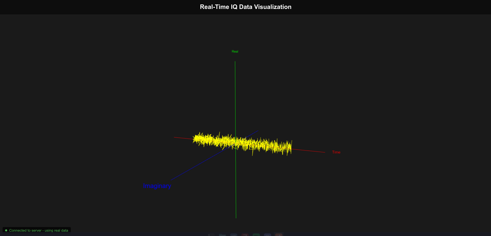

# 🌟 IQ Data Visualizer Project 🌟

Welcome to the IQ Data Visualizer Project! This initiative harnesses the power of a Raspberry Pi and software-defined radio (SDR) to capture radio signals, transmit them to a web server, and showcase them as an interactive 3D visualization on a webpage accessible to all. 📡✨
## 📋 Project Overview

The IQ Visualizer is designed to bridge the gap between invisible radio signals and stunning visual insights. Using a Pluto SDR bootstrapped with an internet connected Raspberry Pi, we collect raw signal data, send it to a web server, and transform it into a dynamic 3D graph for anyone to explore online. 🌐

Here’s what we’re aiming to achieve:

- **Capture Radio Signals**: A Raspberry Pi listens to radio waves and gathers their raw data. 🎙️
- **Transmit Seamlessly**: The data is securely sent to a web server for processing. 🚀
- **Visualize in 3D**: A webpage displays the signals as a clear, interactive 3D graph—highlighting time, real components, and imaginary components. 📊

## 🎯 Our Mission

Our goal is to make radio signal data accessible and engaging. By combining hardware and software, we’re creating a tool that:

- Delivers clear, real-time visualizations of complex signal data. 📈
- Offers an open, browser-based experience for anyone curious about radio signals. 🌍
- Showcases the potential of SDR technology in a user-friendly way. 💡

## 🔑 Key Objectives

- **Stunning Visualization**: Develop a webpage featuring a 3D graph to bring radio signals to life. 🖼️
- **Reliable Data Flow**: Build a system to collect and share signal data efficiently. 🔄
- **Testing Made Easy**: Include a signal simulator to refine the experience before using live data. ⚙️
- **Hardware Integration**: Leverage the Raspberry Pi to capture real-world radio signals. 🍓

## 🖼️ App Preview

